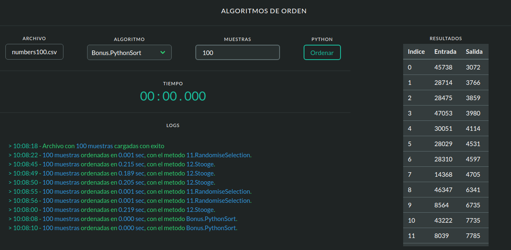

# Python-Solver

> This is a FrontEnd/Backend project to send requests to a python server


## Live Demo


## Built With

- JavaScript
- HTML, CSS
- Python, Flask, Flask-CORS
- Deploy on [Netlify](https://www.netlify.com)

## Deploy
Download or clone this repo
1. Open the index.html with your web browser or the liveview extension on VScode 
```
    http://localhost:5500
```
2. Navigate to the folder containing this repo and start the python server
```
    $ python3 restserver.py
```

## Author

👤 Franco Rosa

- Github: [@FrancoRosa](https://github.com/FrancoRosa)
- Linkedin: [FrancoRosa](https://www.linkedin.com/in/francoro)

## 🤝 Contributing

Contributions, issues and feature requests are welcome!
Feel free to check the [issues page](issues/).

## Show your support

Give a ⭐️ if you like this project!

## Acknowledgments

- [Jenil Gogari](https://jgog.in) for the mod of bulma css framework that I used in this project.

## 📝 License

This project is [MIT](lic.url) licensed.
